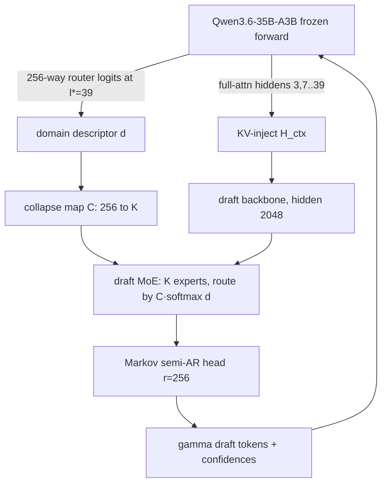

# DSpark-Hydra — Domain-Routed Speculative Drafting via Target-Router Reuse

Research code for testing whether a MoE target model's **own expert router** can be
reused, for free, to drive a **domain-routed MoE draft model** for speculative
decoding — raising per-domain accepted length (τ) on high-entropy domains (chat,
prose) at equal active draft parameters, without touching the lossless guarantee.

Target model (frozen): **Qwen/Qwen3.6-35B-A3B** (`qwen3_5_moe`, 35B total / ~3B active,
256 experts × top-8, hidden 2048, 40 MoE layers, hybrid linear+full attention).

> Full design: `doc/dspark-qwen36-moe-router-reuse-experiment.md` (local only, gitignored).

## The idea in one paragraph

Speculative decoding drafts γ tokens with a small model; the target verifies them by
rejection sampling (lossless for **any** draft distribution). A single small draft
trained across math/code/chat/prose suffers **capacity dilution**. But the target MoE
**already contains a trained domain partitioner** — its per-token 256-way expert
router — and those logits are **already computed** during verification (zero marginal
cost). We collapse the 256 target experts → K draft experts (map `C`) and route a
domain-specialized draft MoE by the target's own decision. Routing changes only the
draft distribution `p^d`; it can never alter the target `p^t` or the acceptance rule,
so every variant is output-equivalent to the target alone (verified in Phase 6).



## Run matrix

| # | Name | Draft | Router | Purpose |
|---|---|---|---|---|
| B0 | Native MTP-1 | ships w/ model | — | production floor (via manual MTP head / vLLM) |
| B3 | DSpark-dense | semi-AR, single FFN | — | paper reproduction, primary control |
| **E1** | **DSpark-MoE-hard** | semi-AR + K-expert MoE | frozen `C` | **main experiment** |
| E2 | DSpark-MoE-soft | semi-AR + K-expert MoE | distilled `R_d` | hard vs soft reuse |
| C1 | DSpark-MoE-scratch | semi-AR + K-expert MoE | from-scratch | isolate reuse value |

All at **equal active FLOPs**. Win: E1 macro-τ ≥ B3 with biggest gains on chat+prose,
≤ +1pt latency, and E1 ≥ C1 (reused router beats from-scratch).

## Repo layout

```
configs/     model + train + variant YAMLs
target/      loader (text-only), hidden/router hooks, native MTP head
collapse/    256→K C-map builders (co-activation / weight / learned) + balance
draft/       backbone, kv_inject, moe_reused_router, markov_head, conf_head
train/       losses (ce/tv/conf/route/bal), STS calibration, loop
eval/        accepted-length τ, position-wise, specialization, losslessness
serving/     (optional) vLLM/SGLang integration + scheduler
scripts/     validate_config, dump_calibration, build_C, run_matrix
reports/     tables, figures, RQ writeups
```

## Infrastructure & workflow

- **Code is authored locally** (`~/devel/dspark-hydra`, macOS). It is the source of truth.
- **All compute runs on DGX Spark** (SSH `localhost:5555`, user `apoc`; GB10, 128GB unified, 1 GPU).
- **Sync:** local `git push` → `git pull` on Spark at `~/devel/dspark-hydra` (remote
  `github.com/apoc/dspark-hydra`, cloned via HTTPS). Never edit on Spark directly.
- **Python env on Spark:** `~/devel/vllm/venv` (transformers 5.9.0, torch 2.11.0+cu130,
  safetensors 0.7.0, CUDA). Do not install packages; the env is pre-provisioned.
- **Model on Spark:** `~/.cache/huggingface/hub/models--Qwen--Qwen3.6-35B-A3B/snapshots/995ad96.../`
  (BF16, 26 shards, 67 GB). FP8 variant also cached. Paths live in `configs/model.yaml`.
- **Fast loading (GB10):** unpinned H2D on GB10 is ~0.16 GB/s (a 67GB CUDA load takes
  ~450s). `target.loader.move_to_cuda_pinned` loads on CPU then streams to GPU through
  pinned memory (~18 GB/s) — full load ~7s warm, ~20s cold. Warm the page cache first:
  `ls <blobs>/* | xargs -P8 -I{} cat {} >/dev/null`.
- `doc/` and `banks/` are gitignored.

## Status

- [x] **Phase 0 — Env & validation.** `scripts/validate_config.py` asserts every §1
      config value and, via one text-only forward, confirms live access to
      (a) full-attn layer hiddens, (b) per-layer 256-way router logits, (c) the native
      MTP-1 head (loaded from checkpoint; HF drops `mtp.*` on load, so we load it
      directly). All checks pass on transformers 5.9.0.
- [x] **Phase 1 — Instrumentation dump.** `scripts/dump_calibration.py` generates target
      responses (chat / prose-completion) and teacher-forces one forward to persist per-token
      hiddens + router logits + next token to sharded safetensors (`target/dump.py`).
      `scripts/verify_dump.py` proves p^t-reconstruction alignment (hidden_final[i]→next_token[i]:
      mean p 0.87, top-1 0.94, vs 111× lower shifted control).
- [x] **Phase 2 — Collapse map `C`.** `collapse/` builds the 256→K map: co-activation (PMI +
      pure-torch spectral clustering, default), weight-similarity (+centroid warm-init), learned.
      `scripts/build_C.py` emits C + balance stats + domain-overlap report. Pure torch (no sklearn/scipy).
- [x] **Phase 3 — Draft model.** `draft/` = KV-injected backbone + domain-routed MoE
      (hard/soft/scratch + dense control) + Markov semi-AR head + confidence head.
      `scripts/test_draft.py` passes fwd/bwd for all §6 rows; active params matched
      (dense 2.03M ≈ MoE active 2.33M) at 3× MoE total capacity.
- [~] Phase 4 — Train (losses + windowed dataloader + loop; training runs)
- [ ] Phase 5 — Offline τ eval
- [ ] Phase 6 — Correctness (lossless) gate
- [ ] Phase 7 — Serving (optional)
- [ ] Phase 8 — Report (RQ1–RQ6)

## Running (on Spark, after `git pull`; `PY=~/devel/vllm/venv/bin/python`)

```bash
# warm the model page cache first (one-time per session): ~12s
ls ~/.cache/huggingface/hub/models--Qwen--Qwen3.6-35B-A3B/blobs/* | xargs -P8 -I{} cat {} >/dev/null

$PY scripts/validate_config.py                                            # Phase 0
$PY scripts/dump_calibration.py --per-domain 100 --out data/calib_v1      # Phase 1 (tmux for scale)
$PY scripts/verify_dump.py --dump data/calib_v1                           # Phase 1 gate
$PY scripts/build_C.py --dump data/calib_v1 --K 16 --warm-init \
     --out data/collapse/coact_k16                                        # Phase 2
CUDA_VISIBLE_DEVICES="" $PY scripts/test_draft.py                         # Phase 3 (toy fwd/bwd)
$PY scripts/train_draft.py --variant E1_hard --dump data/calib_v1 ...     # Phase 4
```

Long jobs run in tmux: `tmux new -d -s <name> '<cmd> 2>&1 | tee logs/<name>.log'`.
