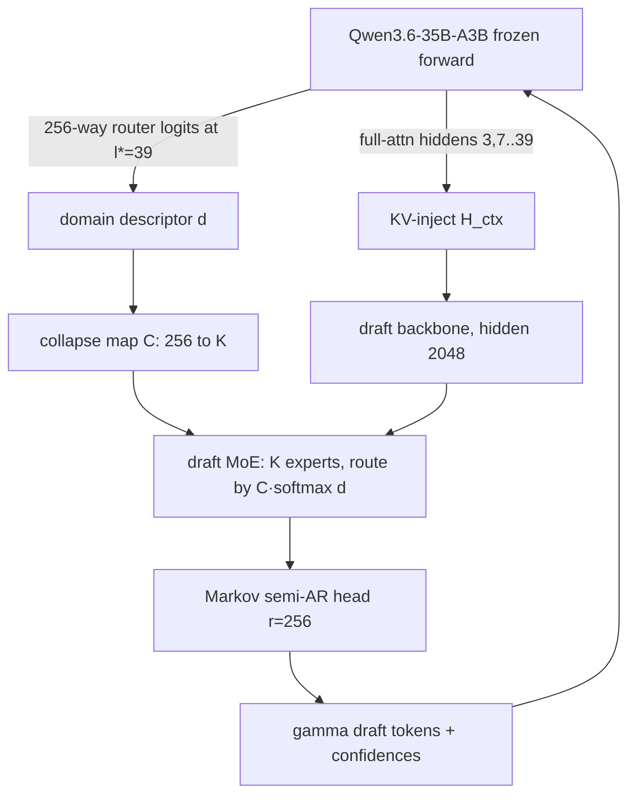

# DSpark-Hydra — Domain-Routed Speculative Drafting via Target-Router Reuse

Research code for testing whether a MoE target model's **own expert router** can be
reused to drive a **domain-routed MoE draft model** for speculative
decoding — raising per-domain accepted length (τ) on high-entropy domains (chat,
prose) at equal active draft parameters, without touching the lossless guarantee.

Target model (frozen): **Qwen/Qwen3.6-35B-A3B** (`qwen3_5_moe`, 35B total / ~3B active,
256 experts × top-8, hidden 2048, 40 MoE layers, hybrid linear+full attention).

> **Full design spec:** [`doc/dspark-qwen36-moe-router-reuse-experiment.md`](doc/dspark-qwen36-moe-router-reuse-experiment.md) — all `§N` references below point into it.
> **Based on** DSpark (Cheng et al., DeepSeek-AI, 2026), [arXiv:2607.05147](https://arxiv.org/abs/2607.05147) — draft/target, accepted length τ, semi-AR + confidence head, prefix scheduler.

## The idea in one paragraph

Speculative decoding drafts γ tokens with a small model; the target verifies them by
rejection sampling (lossless for **any** draft distribution). A single small draft
trained across math/code/chat/prose suffers **capacity dilution**. But the target MoE
**already contains a trained domain partitioner** — its per-token 256-way expert
router. Those logits are **free within a target forward you already run** — but obtaining the
*next anchor's* signal costs a dedicated forward in the current offline engine (`t_anchor ≈ t_verify`;
not a serving-speed claim — see spec errata). We collapse the 256 target experts → K draft experts (map `C`) and route a
domain-specialized draft MoE by the target's own decision. Routing changes only the
draft distribution `p^d`; it can never alter the target `p^t` or the acceptance rule,
so every variant is output-equivalent to the target alone (verified in Phase 6).



## Run matrix

| # | Name | Draft | Router | Purpose |
|---|---|---|---|---|
| B0 | Native MTP-1 | ships w/ model | — | production floor (via manual MTP head / vLLM) |
| B3 | DSpark-dense | semi-AR, single FFN | — | paper reproduction, primary control |
| **E1** | **DSpark-MoE-hard** | semi-AR + K-expert MoE | frozen `C` | **main experiment** |
| E2 | DSpark-MoE-soft | semi-AR + K-expert MoE | distilled `R_d` | hard vs soft reuse |
| C1 | DSpark-MoE-scratch | semi-AR + K-expert MoE | from-scratch | isolate reuse value |

All at **equal active FLOPs**. Win: E1 macro-τ ≥ B3 with biggest gains on chat+prose,
≤ +1pt latency, and E1 ≥ C1 (reused router beats from-scratch).

## Repo layout

```
configs/     model + train + variant YAMLs
target/      loader (text-only), hidden/router hooks, native MTP head
collapse/    256→K C-map builders (co-activation / weight / learned) + balance
draft/       backbone, kv_inject, moe_reused_router, markov_head, conf_head
train/       losses (ce/tv/conf/route/bal), STS calibration, loop
eval/        accepted-length τ, position-wise, specialization, losslessness
serving/     (optional) vLLM/SGLang integration + scheduler
scripts/     validate_config, dump_calibration, build_C, run_matrix
reports/     tables, figures, RQ writeups
```

## Infrastructure & workflow

> Operational details (Spark access, sync flow, Python env, model paths, fast-loading,
> run commands) live in `AGENTS.md` (gitignored). Code is authored locally and synced to
> the DGX Spark for all compute.
## Status

- [x] **Phase 0 — Env & validation.** `scripts/validate_config.py` asserts every §1
      config value and, via one text-only forward, confirms live access to
      (a) full-attn layer hiddens, (b) per-layer 256-way router logits, (c) the native
      MTP-1 head (loaded from checkpoint; HF drops `mtp.*` on load, so we load it
      directly). All checks pass on transformers 5.9.0.
- [x] **Phase 1 — Instrumentation dump.** `scripts/dump_calibration.py` generates target
      responses (chat / prose-completion) and teacher-forces one forward to persist per-token
      hiddens + router logits + next token to sharded safetensors (`target/dump.py`).
      `scripts/verify_dump.py` proves p^t-reconstruction alignment (hidden_final[i]→next_token[i]:
      mean p 0.87, top-1 0.94, vs 111× lower shifted control).
- [x] **Phase 2 — Collapse map `C`.** `collapse/` builds the 256→K map: co-activation (PMI +
      pure-torch spectral clustering, default), weight-similarity (+centroid warm-init), learned.
      `scripts/build_C.py` emits C + balance stats + domain-overlap report. Pure torch (no sklearn/scipy).
- [x] **Phase 3 — Draft model.** `draft/` = KV-injected backbone + domain-routed MoE
      (hard/soft/scratch + dense control) + Markov semi-AR head + confidence head.
      `scripts/test_draft.py` passes fwd/bwd for all §6 rows (toy vocab). At the real config
      (V=248320, hidden 2048, 4 layers) the trained checkpoints are: **dense B3 265.6M** (all
      active); **MoE E1/E2/C1 454M total, ~278M active** (K=16 experts, k'=2). Active params are
      comparable across variants (RQ1); Markov head (127M) + KV-injected backbone (126M) dominate,
      MoE adds 201M expert capacity (~1.7× dense total). This ~0.27B budget is **deliberately small**
      to isolate router reuse at equal active params — **~14× below a production DSpark draft**
      ([RedHat GLM-5.2 speculator](https://huggingface.co/RedHatAI/GLM-5.2-speculator.dspark): 3.807B
      total, 5 layers at hidden 6144 / intermediate 12288; τ≈3.97, same bonus-inclusive convention →
      normalized ≈0.50 vs our 0.29), so **draft capacity, like training-data scale (83k-token dump), is a future lever, not a settled non-issue**.
- [x] **Phase 4 — Train.** Losses (`train/losses.py`: ce/tv/conf/route/bal), windowed
      dataloader (`train/data.py`), loop (`train/loop.py`), `scripts/train_draft.py`.
      **Knowledge-saturation autostop** (validation-plateau early-stop, by-sequence split,
      min-steps floor, best-ckpt restore) instead of fixed steps — all 4 variants trained to
      plateau (9.8k–15.6k steps) on the 83k-token dump.
- [x] **Phase 5 — Offline τ eval.** `eval/spec_decode.py` (draft-propose + target-verify +
      accept/resample) + `eval/analysis.py` (position-wise conditional acceptance,
      specialization heatmap) + `scripts/eval_tau.py`, orchestrated by `scripts/run_matrix.py`.
      Per-domain τ measured for all §6 variants (results below).
- [x] **Phase 6 — Correctness (lossless) gate.** `eval/sampler.py` rejection sampler;
      `scripts/test_losslessness.py` proves accepted-token KL to p^t ≈ 3e-5 for adversarial
      drafts (uniform/peaked-wrong/noisy) — lossless by construction for any p^d, all variants.
- [x] **Phase 8 — Report (RQ1–RQ6).** Full §6 matrix run (sanity-scale, 83k tokens) in
      `reports/phase8_report.md` + `reports/run_matrix.json`. Headline: **E2 soft-reuse
      macro-τ 0.788 > E1 hard 0.777 > C1 scratch 0.763 > B3 dense 0.755** at matched active
      params; soft reuse best and recovers prose (0.570 vs dense 0.533). Gains concentrated
      on code/math (not chat/prose as hypothesized) at this scale — directional support,
      scale-up (vLLM-batched 1M-prompt dump) needed for a verdict.

## Phase status → run commands

Per-phase run commands are in `AGENTS.md`. Scripts: `validate_config.py` (0),
`dump_calibration.py` / `verify_dump.py` (1), `build_C.py` (2), `test_draft.py` (3),
`train_draft.py` (4), `test_losslessness.py` (6).
